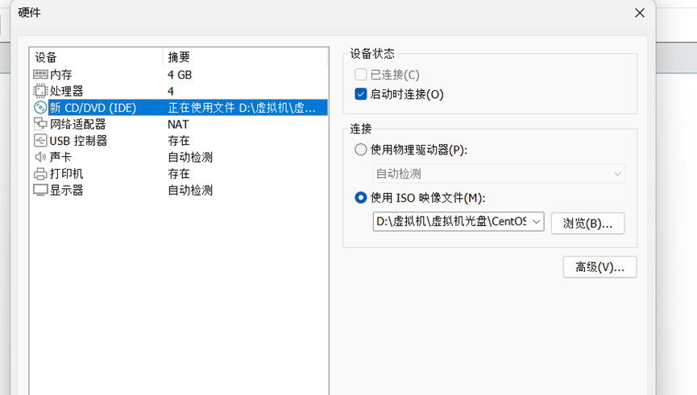
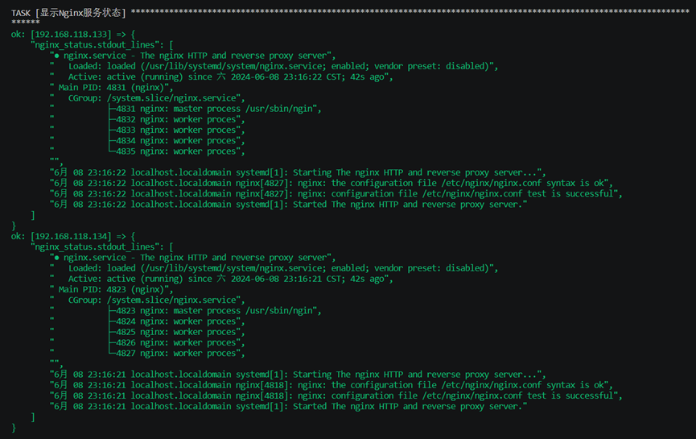
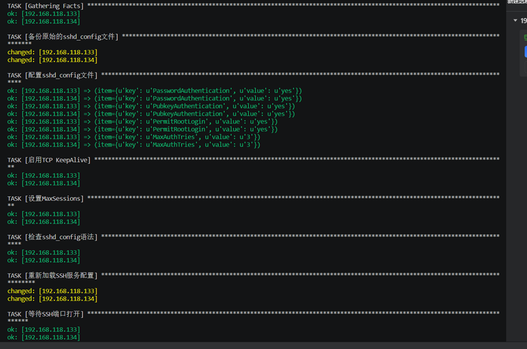
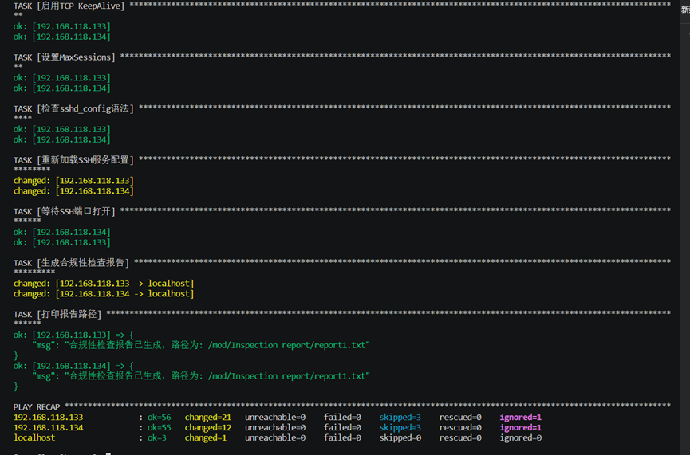
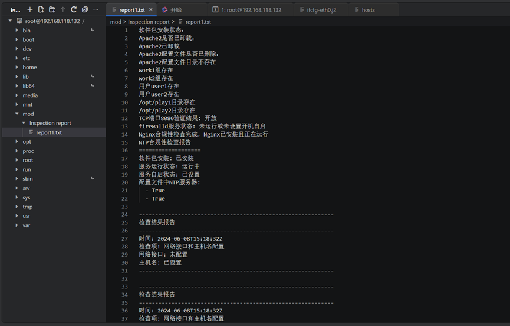

> 实验环境配置,

    光盘：CentOS-7-x86_64-Minimal-2003.iso

    虚拟机系统：linux  centos 7

    主机端与客户端设置基础设置



# 1.自动化配置管理

## 1.1 使用ansible剧本功能，自动化配置多个服务器的系统参数，以下本剧本是可实现的功能

自动化配置

    软件包管理配置

        软件包的安装

        软件包的更新

        软件包的卸载

    用户管理配置

        新建用户与组

        管理组的权限

    防火墙配置

        打开TCP端口8080

        保障防火墙正常运行且开机自启

    服务管理配置（以nginx为例）

        启动Nginx服务

        检查Nginx服务状态

        显示Nginx服务状态

    配置系统时间同步

        配置NTP时间同步

    配置网络接口和host文件

        添加新的网络接口

        在hosts文件中添加条目

    ssh配置

        备份原始sshd_config文件

        配置sshd_config文件

        启用TCP KeepAlive

        设置MaxSessions


## 1.2 添加网络接口模板脚本，添加路径`/etc/sysconfig/network-scripts/ifcfg-eth0.j2`

```Markdown
BOOTPROTO=none                # 使用静态IP地址  
IPADDR={{ ip_address }}       # 设置IP地址  
NETMASK={{ netmask }}         # 设置子网掩码 
GATEWAY={{ gateway }}         # 设置默认网关  
DNS1={{ dns_servers[0] }}     # 设置主DNS服务器，使用Ansible变量中的第一个DNS地址  
DNS2={{ dns_servers[1] }}     # 设置备用DNS服务器，使用Ansible变量中的第二个DNS地址  
DEFROUTE=yes                  # 启用默认路由  
IPV4_FAILURE_FATAL=no         # 如果IPv4配置失败，不终止启动过程  
IPV6INIT=no                   # 禁用IPv6初始化  
NAME="{{ interface_name }}"    # 设置网络接口的名称  
UUID=<UUID-OF-THE-INTERFACE>  # 设置网络接口的唯一标识符  
ONBOOT=yes                    # 系统启动时激活此网络接口

```

## 1.3 实现自动化配置的ansible playbook

```Markdown
# 1.软件包管理配置（软件包的安装与更新）
- name: 软件包的安装
  hosts: tan 
  tasks:
    
    - name: 安装软件包  
      apt:  
        name:  # 要安装的软件包列表  
          - nginx
          - apache2
          - python3  
          - python3-pip  
        state: present  
        update_cache: yes  # 在安装前更新APT包缓存  
      when: ansible_os_family == 'Debian'  
  
    - name: 更新所有软件包  
      apt:  
        upgrade: dist  
      when: ansible_os_family == 'Debian' 
      
- name: 卸载apache2软件包
  hosts: tan 
  tasks: 
  
    - name: 卸载apache2（如果需要的话）  
      apt:  
        name: apache2  
        state: absent  
        autoremove: yes  
      when: ansible_os_family == 'Debian'   
    
    
    - name: 删除apache2配置文件  
      file:  
        path: /etc/apache2/  
        state: absent   
      
      
- name: 用户管理配置，防火墙配置，服务管理配置 
  hosts: tan 
  tasks:   
      
  # 2.用户管理配置 
    - name: 确保work1组存在  
      group:  
        name: work1  # 定义要创建的组名为work1  
        state: present  # 如果组不存在，则创建它；如果已存在，则不做任何操作  
  
     
    - name: 配置sudoers以允许work1组的成员使用sudo  
      lineinfile:  
        path: /etc/sudoers  # 指定要编辑的文件路径为/etc/sudoers  
        state: present  # 如果指定的行不存在，则添加它  
        regexp: '^%work1'  # 使用正则表达式匹配以'%work1'开头的行  
        line: '%work1 ALL=(ALL:ALL) ALL'  # 如果行不存在，则添加这一行到sudoers文件中  
        validate: 'visudo -cf %s'  # 使用visudo命令来验证sudoers文件的语法是否正确  
  
  
    - name: 添加新用户user1  
      user:  
        name: user1  # 定义新用户的用户名为user1  
        groups: work1  # 将新用户添加到work1组  
        append: yes  # 如果用户已存在于其他组，则追加到work1组，而不是替换原有的组  
        create_home: yes  # 为新用户创建主目录  
    
    
    - name: 确保 /opt/play1 目录存在  
      file:  
        path: /opt/play1  
        state: directory  
        mode: '0755'  
        owner: user1  
        group: work1  
  
    - name: 在 /opt/play1 目录下创建 file1 文件  
      file:  
        path: /opt/play1/file1
        state: touch  
        mode: '0644'  
        owner: user1  
        group: work1  


    - name: 确保work2组存在  
      group:  
        name: work2  # 定义要创建的组名为work2  
        state: present  # 如果组不存在，则创建它；如果已存在，则不做任何操作  
  
     
    - name: 配置sudoers以允许work2组的成员使用sudo  
      lineinfile:  
        path: /etc/sudoers  # 指定要编辑的文件路径为/etc/sudoers  
        state: present  # 如果指定的行不存在，则添加它  
        regexp: '^%work2'  # 使用正则表达式匹配以'%work2'开头的行  
        line: '%work2 ALL=(ALL:ALL) ALL'  # 如果行不存在，则添加这一行到sudoers文件中  
        validate: 'visudo -cf %s'  # 使用visudo命令来验证sudoers文件的语法是否正确  
  
  
    - name: 添加新用户user2  
      user:  
        name: user2  # 定义新用户的用户名为user2  
        groups: work2  # 将新用户添加到work2组  
        append: yes  # 如果用户已存在于其他组，则追加到work2组，而不是替换原有的组  
        create_home: yes  # 为新用户创建主目录  
    
    
    - name: 确保/opt/play2目录存在  
      file:  
        path: /opt/play2  
        state: directory  
        mode: '0755'  
        owner: user2  
        group: work2  
  
    - name: 在 /opt/play2 目录下创建 file2 文件  
      file:  
        path: /opt/play2/file2 
        state: touch  
        mode: '0644'  
        owner: user2  
        group: work2  
  
        
  # 3.防火墙配置 
    - name: 打开TCP端口8080  
      firewalld:  
        port: 8080/tcp  # 要开放的端口  
        permanent: yes  # 设置规则为永久生效  
        state: enabled  # 启用该端口  
        immediate: yes  # 使更改立即生效  
      tags:  
        - firewall  # 使用tags可以通过ansible-playbook命令选择运行该任务  
  
  
    - name: 确保firewalld服务正在运行且开机自启  
      service:  
        name: firewalld  
        state: started  # 启动服务  
        enabled: yes  # 设置服务为开机自启  
      tags:  
        - firewall  # 同样使用tags来标识任务  
        
        
  # 4.服务管理配置（以nginx为例）
    - name: 添加EPEL仓库  
      yum_repository:  
        name: epel  
        description: EPEL YUM repo  
        baseurl: https://download.fedoraproject.org/pub/epel/$releasever/$basearch/  
        gpgcheck: yes  
        gpgkey: https://download.fedoraproject.org/pub/epel/RPM-GPG-KEY-EPEL-$releasever


    - name: 更新yum缓存  
      yum:  
        update_cache: yes


    - name: 安装Nginx（如果尚未安装）  
      package:  
        name: nginx  # 安装Nginx软件包  
        state: present  # 确保软件包已安装  
  
  
    - name: 启动Nginx服务并设置为开机自启  
      service:  
        name: nginx  # Nginx服务名  
        state: started  # 启动服务  
        enabled: yes  # 设置为开机自启  
  
    
    - name: 检查Nginx服务状态  
      command: systemctl status nginx  
      register: nginx_status  
      ignore_errors: yes  # 如果Nginx未安装或未运行，不中断剧本  
  
  
    - name: 显示Nginx服务状态  
      debug:  
        var: nginx_status.stdout_lines  
      when: nginx_status.rc == 0  # 只显示当Nginx服务正常时的状态

  handlers:  
    - name: Reload firewalld   
      service:  
        name: firewalld  
        state: reloaded  
  
  
    - name: Restart service    
      service:  
        name: "{{ service_name }}"  
        state: restarted 
        
        
# 5.配置系统时间同步的Ansible Playbook    
- name: 配置NTP时间同步  
  hosts: tan  
  become: yes  
  become_method: sudo  
  
  tasks:  
    - name: 安装NTP软件包  
      package:  
        name: ntp  
        state: present  
  
  
    - name: 配置NTP服务器  
      lineinfile:  
        path: /etc/ntp.conf  
        line: "server <NTP_SERVER_1> iburst"  # 使用iburst选项  
        insertafter: EOF  # 在文件末尾添加  
      notify: 重启NTP服务  
  
    
    - name: 配置额外的NTP服务器  
      lineinfile:  
        path: /etc/ntp.conf  
        line: "server <NTP_SERVER_2> iburst"  
        insertafter: EOF  
      notify: 重启NTP服务  
  
  
    - name: 启动并启用ntp服务  
      systemd:  
        name: ntpd  
        state: started  
        enabled: yes  
  
  handlers:  
    - name: 重启NTP服务  
      service:  
        name: ntpd
        state: restarted
        
        
# 6.配置网络接口和host文件
- name: 配置网络接口和 hosts 文件   
  hosts: tan  
  become: yes  
  
  vars:  
    interface_name: "ens33"  # 网络接口名称  
    ip_address: "192.168.1.10"   # IP 地址
    netmask: "255.255.255.0"   # 子网掩码 
    gateway: "192.168.1.1"    # 默认网关 
    dns_servers: ["8.8.8.8", "8.8.4.4"]    # DNS 服务器列表 
    hostname: "tan2"    # 主机名  
   
  tasks:   
    - name: 配置网络接口   
      template:   
        src: /etc/sysconfig/network-scripts/ifcfg-eth0.j2   # 模板源文件路径  
        dest: "/etc/sysconfig/network-scripts/ifcfg-{{ interface_name }}"  # 目标文件路径    
        owner: root  # 文件所有者为 root  
        group: root   # 文件组为 root  
        mode: '0644'   # 文件权限为 0644  
      notify: 重启网络服务   # 触发名为 '重启网络服务' 的 handler 
  
  
    - name: 在 /etc/hosts 文件中添加条目  
      lineinfile:  
        path: /etc/hosts    # 文件路径  
        line: "{{ ip_address }} {{ hostname }}.example.com {{ hostname }}"  # 要添加的行   
        regexp: "^\\s*{{ ip_address }}\\s+.*{{ hostname }}\\s*$"    # 用于检查行是否已存在的正则表达式  
  
    - name: 设置主机名  
      hostname:  
        name: "{{ hostname }}"   # 要设置的主机名  
  
  handlers:  
    - name: 重启网络服务   
      service:  
        name: NetworkManager  
        state: restarted  # 服务状态为重启 
  
  
 # 7.ssh配置
- name: 配置SSH服务    
  hosts: tan  
  become: yes   
  
  vars:  
    ssh_config_defaults:    
      PermitRootLogin: "yes"  # 启动root用户通过SSH登录  
      PasswordAuthentication: "yes"  # 启动密码认证  
      PubkeyAuthentication: "yes"  # 启用公钥认证  
      MaxAuthTries: "3"  # 最大认证尝试次数  
  
  tasks:  
    - name: 备份原始的sshd_config文件   
      copy: 
        src: /etc/ssh/sshd_config  # 源文件路径  
        dest: /etc/ssh/sshd_config.bak  # 目标文件路径  
        remote_src: yes  # 源文件在远程主机上  
        backup: yes  # 备份原始文件  
  
  
    - name: 配置sshd_config文件    
      lineinfile:    
        path: /etc/ssh/sshd_config  # 配置文件路径  
        regexp: '^\s*{{ item.key }}\s'  # 匹配要替换的行的正则表达式  
        line: '{{ item.key }} {{ item.value }}'  # 替换后的行内容  
        backup: yes  # 备份原始配置文件  
      loop: "{{ ssh_config_defaults | dict2items }}"  # 循环遍历ssh_config_defaults字典  
   
    - name: 启用TCP KeepAlive    
      lineinfile:  
        path: /etc/ssh/sshd_config  # 配置文件路径  
        regexp: '^ClientAliveInterval'  # 匹配行的正则表达式  
        line: 'ClientAliveInterval 300'  # 替换后的行内容  
        backup: yes  # 备份原始配置文件  
  
  
    - name: 设置MaxSessions    
      lineinfile: 
        path: /etc/ssh/sshd_config  # 配置文件路径  
        regexp: '^MaxSessions'  # 匹配行的正则表达式  
        line: 'MaxSessions 10'  # 替换后的行内容  
        backup: yes  # 备份原始配置文件  
  
  
    - name: 检查sshd_config语法   
      command: sshd -t -f /etc/ssh/sshd_config    
      register: sshd_config_check  # 注册命令执行结果到变量  
      changed_when: false  # 不考虑命令执行后的变化  
      failed_when: "'Bad configuration option' in sshd_config_check.stderr or 'line' in sshd_config_check.stderr"  # 当命令的stderr包含指定字符串时认为失败  
  
  
    - name: 重新加载SSH服务配置    
      service:   
        name: sshd  # 服务名称  
        state: reloaded  # 服务状态：重新加载配置  
  

    - name: 等待SSH端口打开    
      wait_for:   
        host: "{{ ansible_host }}"  # 等待的主机  
        port: 22  # 等待的端口  
        state: started  # 等待的状态  
        delay: 5  # 等待前的延迟时间  
        timeout: 30  # 等待超时时间
```


# 2. 配置合规性检查机制

## 2.1 检查项目一的服务器配置是否已经按预定义标准进行，并对不合规项的内容进行修复，并且在主机端的`report1.txt`文件中生成合规性检查报告

```Markdown
- name: 软件包的安装及Apache2卸载与配置检查
  hosts: tan
  tasks:
    - name: 安装软件包  
      yum:  
        name: 
          - nginx
          - httpd
          - python3  
          - python3-pip  
        state: present

    - name: 卸载Apache2软件包  
      yum:  
        name: httpd  
        state: absent

    - name: 删除Apache2配置文件  
      file:  
        path: /etc/httpd/  
        state: absent
      when: ansible_pkg_mgr == 'yum'


- name: 生成合规性检查报告
  hosts: localhost
  tasks:
    - name: 创建合规性检查报告目录
      file:
        path: "/mod/Inspection report"
        state: directory
    
    - name: 执行合规性检查
      shell: |
        echo "软件包安装状态：" > "/mod/Inspection report/report1.txt"
        rpm -qa nginx httpd python3 python3-pip >> "/mod/Inspection report/report1.txt"
        echo "Apache2是否已卸载：" >> "/mod/Inspection report/report1.txt"
        rpm -qa httpd | grep -q '^httpd' || echo "Apache2已卸载" >> "/mod/Inspection report/report1.txt"
        echo "Apache2配置文件是否已删除：" >> "/mod/Inspection report/report1.txt"
        if [ -d "/etc/httpd/" ]; then
          ls -l /etc/httpd/ >> "/mod/Inspection report/report1.txt"
        else
          echo "Apache2配置文件目录不存在" >> "/mod/Inspection report/report1.txt"
        fi
      delegate_to: localhost
    
    
- name: 用户管理配置，防火墙配置，服务管理配置检查
  hosts: tan
  tasks:
    - name: 检查work1组是否存在
      command: getent group work1
      register: work1_group_check
      ignore_errors: yes

    - name: 记录work1组检查结果
      lineinfile:
        path: /mod/Inspection report/report1.txt
        line: "work1组{{ '存在' if 'work1' in work1_group_check.stdout else '不存在' }}"
      delegate_to: localhost

    - name: 检查work2组是否存在
      command: getent group work2
      register: work2_group_check
      ignore_errors: yes

    - name: 记录work2组检查结果
      lineinfile:
        path: /mod/Inspection report/report1.txt
        line: "work2组{{ '存在' if 'work2' in work2_group_check.stdout else '不存在' }}"
      delegate_to: localhost

    - name: 检查是否存在用户user1
      command: id user1
      register: user1_check
      ignore_errors: yes

    - name: 记录用户user1检查结果
      lineinfile:
        path: /mod/Inspection report/report1.txt
        line: "用户user1{{ '存在' if 'uid' in user1_check.stdout else '不存在' }}"
      delegate_to: localhost

    - name: 检查是否存在用户user2
      command: id user2
      register: user2_check
      ignore_errors: yes

    - name: 记录用户user2检查结果
      lineinfile:
        path: /mod/Inspection report/report1.txt
        line: "用户user2{{ '存在' if 'uid' in user2_check.stdout else '不存在' }}"
      delegate_to: localhost

    - name: 检查/opt/play1目录是否存在
      stat:
        path: /opt/play1
      register: opt_play1_check

    - name: 记录/opt/play1目录检查结果
      lineinfile:
        path: /mod/Inspection report/report1.txt
        line: "/opt/play1目录{{ '存在' if opt_play1_check.stat.exists else '不存在' }}"
      delegate_to: localhost

    - name: 检查/opt/play2目录是否存在
      stat:
        path: /opt/play2
      register: opt_play2_check

    - name: 记录/opt/play2目录检查结果
      lineinfile:
        path: /mod/Inspection report/report1.txt
        line: "/opt/play2目录{{ '存在' if opt_play2_check.stat.exists else '不存在' }}"
      delegate_to: localhost    


- name: 合规性修复 - 打开TCP端口8080并确保firewalld服务状态
  hosts: tan
  become: yes

  tasks:
    # 修复步骤：打开TCP端口8080
    - name: 打开TCP端口8080
      firewalld:
        port: 8080/tcp
        permanent: yes
        state: enabled
        immediate: yes
      tags:
        - firewall_fix

    # 修复步骤：确保firewalld服务正在运行且开机自启
    - name: 确保firewalld服务正在运行且开机自启
      service:
        name: firewalld
        state: started
        enabled: yes
      tags:
        - firewalld_fix

  post_tasks:
   
    - name: 验证TCP端口8080是否已开放
      command: firewall-cmd --query-port=8080/tcp
      register: port_check
      changed_when: false

    - name: 输出TCP端口8080验证结果
      lineinfile:
        path: /mod/Inspection report/report1.txt
        line: "TCP端口8080验证结果: {{ '开放' if port_check.rc == 0 else '未开放' }}"
      delegate_to: localhost
      when: port_check.rc is defined

   
    - name: 收集firewalld服务状态
      service_facts:

    - name: 验证firewalld服务状态
      lineinfile:
        path: /mod/Inspection report/report1.txt
        line: "firewalld服务状态: {{ '正在运行且开机自启' if 'firewalld' in ansible_facts.services and ansible_facts.services['firewalld'].state == 'running' and ansible_facts.services['firewalld'].enabled else '未运行或未设置开机自启' }}"
      delegate_to: localhost

    - name: 收集服务事实
      service_facts:
      tags: firewall_check

    - name: 检查firewalld是否设置了开机自启
      lineinfile:
        path: /mod/Inspection report/report1.txt
        line: "firewalld已设置开机自启"
      delegate_to: localhost
      when: "'firewalld' in ansible_facts.services and ansible_facts.services['firewalld'].enabled"
      tags: firewall_check

    - name: 通知firewalld未设置开机自启
      lineinfile:
        path: /mod/Inspection report/report1.txt
        line: "firewalld未设置开机自启"
      delegate_to: localhost
      when: "'firewalld' in ansible_facts.services and not ansible_facts.services['firewalld'].enabled"
      tags: firewall_check


- name: 合规性检查 - 确保Nginx已安装并运行
  hosts: tan
  become: yes

  tasks:
    # 检查Nginx是否已安装
    - name: 收集已安装包的信息
      package_facts:

    - name: 验证Nginx是否已安装
      assert:
        that:
          - "'nginx' in ansible_facts.packages"
        msg: "Nginx未安装，需要安装以符合安全标准"

    # 检查Nginx服务状态
    - name: 检查Nginx服务状态
      command: systemctl status nginx
      register: nginx_status
      failed_when: "'Active: active (running)' not in nginx_status.stdout"

    # 报告结果
    - name: 生成合规性报告
      lineinfile:
        path: /mod/Inspection report/report1.txt
        line: "Nginx合规性检查完成，Nginx已安装且正在运行"
      delegate_to: localhost
      when: "'nginx' in ansible_facts.packages and nginx_status.rc == 0"


- name: 检查并修复Nginx合规性问题
  hosts: tan
  become: yes

  tasks:
    - name: 安装Nginx（如果尚未安装）
      package:
        name: nginx
        state: present
      when: "'nginx' not in ansible_facts.packages"

    - name: 启动Nginx服务并设置为开机自启
      service:
        name: nginx
        state: started
        enabled: yes


- name: NTP合规性检查
  hosts: tan
  become: yes
  become_method: sudo

  tasks:
    - name: 检查NTP软件包是否已安装
      package_facts:
        manager: auto  # 使用自动检测的包管理器

    - name: 验证NTP软件包是否已安装
      assert:
        that:
          - "'ntp' in ansible_facts.packages"
        msg: "NTP软件包未安装"

    - name: 检查NTP服务状态
      systemd:
        name: ntpd
      register: ntp_service_status

    - name: 验证NTP服务是否正在运行
      assert:
        that:
          - ntp_service_status.status.ActiveState == 'active'
        msg: "NTP服务未运行"

    - name: 验证NTP服务是否已设置为开机自启
      assert:
        that:
          - ntp_service_status.status.LoadState == 'loaded'  # 例如，检查服务是否已加载
        msg: "NTP服务未设置为开机自启"

    - name: 读取NTP配置文件
      slurp:
        src: /etc/ntp.conf
      register: ntp_conf_content

    - name: 验证NTP配置文件中是否包含预定义的NTP服务器
      assert:
        that:
          - "'<NTP_SERVER_1>' in ntp_conf_content.content | b64decode"
          - "'<NTP_SERVER_2>' in ntp_conf_content.content | b64decode"
        msg: "NTP配置文件中未包含预定义的NTP服务器"

  # 报告结果（将结果追加到报告文件末尾）
  post_tasks:
    - name: 生成NTP合规性检查报告
      block:
        - name: 生成合规性检查报告
          lineinfile:
            path: /mod/Inspection report/report1.txt
            line: |
              NTP合规性检查报告
              ===================
              软件包安装: {{ '已安装' if 'ntp' in ansible_facts.packages else '未安装' }}
              服务运行状态: {{ '运行中' if ntp_service_status.status.ActiveState == 'active' else '未运行' }}
              服务自启状态: {{ '已设置' if ntp_service_status.status.LoadState == 'loaded' else '未设置' }}
              配置文件中NTP服务器:
                - {{ '<NTP_SERVER_1>' in ntp_conf_content.content | b64decode }}
                - {{ '<NTP_SERVER_2>' in ntp_conf_content.content | b64decode }}
          delegate_to: localhost
          run_once: yes


- name: 检查网络接口和主机名配置
  hosts: tan
  become: yes

  vars:
    interface_name: "ens33"  # 网络接口名称
    ip_address: "192.168.1.10"   # IP 地址
    netmask: "255.255.255.0"   # 子网掩码
    gateway: "192.168.1.1"    # 默认网关
    dns_servers: ["8.8.8.8", "8.8.4.4"]    # DNS 服务器列表
    hostname: "tan2"    # 主机名
    report_file_path: "/mod/Inspection report/report1.txt"

  tasks:
    - name: 检查网络接口配置
      assert:
        that:
          - ansible_interfaces | select('match', interface_name) | list | count == 1  # 检查网络接口是否存在
          - ansible_default_ipv4.address == ip_address  # 检查IP地址是否正确配置
          - ansible_default_ipv4.netmask == netmask  # 检查子网掩码是否正确配置
          - ansible_default_ipv4.gateway == gateway  # 检查默认网关是否正确配置
          - ansible_dns.nameservers == dns_servers  # 检查DNS服务器是否正确配置
      register: interface_check
      ignore_errors: true  # 忽略错误，不影响后续任务执行

    - name: 检查主机名配置
      assert:
        that:
          - ansible_hostname == hostname  # 检查主机名是否正确配置
      register: hostname_check
      ignore_errors: true  # 忽略错误，不影响后续任务执行

    - name: 生成检查报告
      lineinfile:
        path: "{{ report_file_path }}"
        line: |
          ------------------------------------------------------------
          检查结果报告
          ------------------------------------------------------------
          时间: {{ ansible_date_time.iso8601 }}
          检查项: 网络接口和主机名配置
          网络接口: {{ '已配置' if interface_check.failed == false else '未配置' }}
          主机名: {{ '已设置' if hostname_check.failed == false else '未设置' }}
          ------------------------------------------------------------
        insertafter: EOF
      delegate_to: localhost


- name: 配置SSH服务
  hosts: tan
  become: yes

  vars:
    ssh_config_defaults:
      PermitRootLogin: "yes"  # 启用root用户通过SSH登录
      PasswordAuthentication: "yes"  # 启用密码认证
      PubkeyAuthentication: "yes"  # 启用公钥认证
      MaxAuthTries: "3"  # 最大认证尝试次数
    compliance_report_path: "/mod/Inspection report/report1.txt"

  tasks:
    - name: 备份原始的sshd_config文件
      copy:
        src: /etc/ssh/sshd_config  # 源文件路径
        dest: /etc/ssh/sshd_config.bak  # 目标文件路径
        remote_src: yes  # 源文件在远程主机上
        backup: yes  # 备份原始文件

    - name: 获取sshd_config文件内容
      shell: cat /etc/ssh/sshd_config
      register: sshd_config_content

    - name: 配置sshd_config文件
      lineinfile:
        path: /etc/ssh/sshd_config  # 配置文件路径
        regexp: '^\s*{{ item.key }}\s'  # 匹配要替换的行的正则表达式
        line: '{{ item.key }} {{ item.value }}'  # 替换后的行内容
        backup: yes  # 备份原始配置文件
      loop: "{{ ssh_config_defaults | dict2items }}"  # 循环遍历ssh_config_defaults字典

    - name: 启用TCP KeepAlive
      lineinfile:
        path: /etc/ssh/sshd_config  # 配置文件路径
        regexp: '^ClientAliveInterval'  # 匹配行的正则表达式
        line: 'ClientAliveInterval 300'  # 替换后的行内容
        backup: yes  # 备份原始配置文件

    - name: 设置MaxSessions
      lineinfile:
        path: /etc/ssh/sshd_config  # 配置文件路径
        regexp: '^MaxSessions'  # 匹配行的正则表达式
        line: 'MaxSessions 10'  # 替换后的行内容
        backup: yes  # 备份原始配置文件

    - name: 检查sshd_config语法
      command: sshd -t -f /etc/ssh/sshd_config
      register: sshd_config_check  # 注册命令执行结果到变量
      changed_when: false  # 不考虑命令执行后的变化
      failed_when: "'Bad configuration option' in sshd_config_check.stderr or 'line' in sshd_config_check.stderr"  # 当命令的stderr包含指定字符串时认为失败

    - name: 重新加载SSH服务配置
      service:
        name: sshd  # 服务名称
        state: reloaded  # 服务状态：重新加载配置

    - name: 等待SSH端口打开
      wait_for:
        host: "{{ ansible_host }}"  # 等待的主机
        port: 22  # 等待的端口
        state: started  # 等待的状态
        delay: 5  # 等待前的延迟时间
        timeout: 30  # 等待超时时间

    - name: 生成合规性检查报告
      shell: |
        echo "SSH Configuration Compliance Report" >> "{{ compliance_report_path }}"
        echo "=================================" >> "{{ compliance_report_path }}"
        echo "" >> "{{ compliance_report_path }}"
        echo "- PermitRootLogin: {{ 'yes' if ssh_config_defaults.PermitRootLogin == 'yes' else 'no' }}" >> "{{ compliance_report_path }}"
        echo "- PasswordAuthentication: {{ 'yes' if ssh_config_defaults.PasswordAuthentication == 'yes' else 'no' }}" >> "{{ compliance_report_path }}"
        echo "- PubkeyAuthentication: {{ 'yes' if ssh_config_defaults.PubkeyAuthentication == 'yes' else 'no' }}" >> "{{ compliance_report_path }}"
        echo "- MaxAuthTries: {{ ssh_config_defaults.MaxAuthTries }}" >> "{{ compliance_report_path }}"
      delegate_to: localhost

    - name: 打印报告路径
      debug:
        msg: "合规性检查报告已生成，路径为: {{ compliance_report_path }}"
```

## 2.2 合规性检查报告的内容

```Markdown
软件包安装状态：
Apache2是否已卸载：
Apache2已卸载
Apache2配置文件是否已删除：
Apache2配置文件目录不存在
work1组存在
work2组存在
用户user1存在
用户user2存在
/opt/play1目录存在
/opt/play2目录存在
TCP端口8080验证结果: 开放
firewalld服务状态: 未运行或未设置开机自启
Nginx合规性检查完成，Nginx已安装且正在运行
NTP合规性检查报告
===================
软件包安装: 已安装
服务运行状态: 运行中
服务自启状态: 已设置
配置文件中NTP服务器:
  - True
  - True

------------------------------------------------------------
检查结果报告
------------------------------------------------------------
时间: 2024-06-08T15:18:32Z
检查项: 网络接口和主机名配置
网络接口: 未配置
主机名: 已设置
------------------------------------------------------------

------------------------------------------------------------
检查结果报告
------------------------------------------------------------
时间: 2024-06-08T15:18:32Z
检查项: 网络接口和主机名配置
网络接口: 未配置
主机名: 已设置
------------------------------------------------------------

SSH Configuration Compliance Report
=================================

- PermitRootLogin: yes
- PasswordAuthentication: yes
- PubkeyAuthentication: yes
- MaxAuthTries: 3
SSH Configuration Compliance Report
=================================

- PermitRootLogin: yes
- PasswordAuthentication: yes
- PubkeyAuthentication: yes
- MaxAuthTries: 3

```


# 3. 实验过程与合规性检查报告截图（若图片未显示出来请查阅压缩包中的`/截图`文件夹）

## 3.1 配置服务器过程截图






## 3.2 合规性检查




## 3.3 生成的合规性检查报告



# 4. 实验过程中遇到过的一些困难

## 4.1 在安装配置Nginx软件包时总是安装不成功，后来发现是安装源的问题，Nginx不在默认的yum源中，所以加入了epel仓库

```Markdown
  - name: 添加EPEL仓库  
      yum_repository:  
        name: epel  
        description: EPEL YUM repo  
        baseurl: https://download.fedoraproject.org/pub/epel/$releasever/$basearch/  
        gpgcheck: yes  
        gpgkey: https://download.fedoraproject.org/pub/epel/RPM-GPG-KEY-EPEL-$releasever


    - name: 更新yum缓存  
      yum:  
        update_cache: yes
```


## 4.2 在配置网络接口时由于不会写网络接口模板脚本卡了很长一段时间，后来是在gtp的帮助下学习了模板脚本的格式才完成的


## 4.3 写ssh配置时总是因为部分地方错误的修改了sshd_config文件导致主机与客户端失去连接，后来发现是因为关闭了密码认证的原因，因为主机与客户端端之间使用的是公钥认证，但是分配密钥时仍然需要密码，如果关闭密码认证就会导致密钥无法分发

```Markdown
name: 配置SSH服务
hosts: tan
become: yes
vars:
ssh_config_defaults:
PermitRootLogin: "yes"  # 启动root用户通过SSH登录
PasswordAuthentication: "yes"  # 启动密码认证
PubkeyAuthentication: "yes"  # 启用公钥认证
MaxAuthTries: "3"  # 最大认证尝试次数

```


## 4.4 在生成合规性检查报告时会出现每条生成的报告会覆盖掉前一条报告的内容，导致报告文件中只剩一条报告的内容，后面在gtp的帮助下更改的生成报告文件的方式，将复制更改为追加在文件末尾

```Markdown
  post_tasks:
    - name: 生成NTP合规性检查报告
      block:
        - name: 生成合规性检查报告
          lineinfile:
            path: /mod/Inspection report/report1.txt
            line: |
              NTP合规性检查报告
              ===================
              软件包安装: {{ '已安装' if 'ntp' in ansible_facts.packages else '未安装' }}
              服务运行状态: {{ '运行中' if ntp_service_status.status.ActiveState == 'active' else '未运行' }}
              服务自启状态: {{ '已设置' if ntp_service_status.status.LoadState == 'loaded' else '未设置' }}
              配置文件中NTP服务器:
                - {{ '<NTP_SERVER_1>' in ntp_conf_content.content | b64decode }}
                - {{ '<NTP_SERVER_2>' in ntp_conf_content.content | b64decode }}
          delegate_to: localhost
          run_once: yes
```

## 4.5 在运行过项目一剧本后的几分钟主机与客户机会断开连接，这是由于更改了网络接口导致的，需要在客户机的网络操作页面重新连接网关


# 5. 引用的文章及GTP

实验思路来源：[https://blog.csdn.net/nujnus9221/article/details/139307729](https://blog.csdn.net/nujnus9221/article/details/139307729) 使用 Ansible 进行集群安全合规性扫描

gtp引用内容

```Markdown
   - name: 添加EPEL仓库  
      yum_repository:  
        name: epel  
        description: EPEL YUM repo  
        baseurl: https://download.fedoraproject.org/pub/epel/$releasever/$basearch/  
        gpgcheck: yes  
        gpgkey: https://download.fedoraproject.org/pub/epel/RPM-GPG-KEY-EPEL-$releasever


- name: 显示Nginx服务状态  
      debug:  
        var: nginx_status.stdout_lines  
      when: nginx_status.rc == 0  # 只显示当Nginx服务正常时的状态

- name: 配置sshd_config文件    
      lineinfile:    
        path: /etc/ssh/sshd_config  # 配置文件路径  
        regexp: '^\s*{{ item.key }}\s'  # 匹配要替换的行的正则表达式  
        line: '{{ item.key }} {{ item.value }}'  # 替换后的行内容  
        backup: yes  # 备份原始配置文件  
      loop: "{{ ssh_config_defaults | dict2items }}"  # 循环遍历ssh_config_defaults字典  
- name: 检查sshd_config语法   
      command: sshd -t -f /etc/ssh/sshd_config    
      register: sshd_config_check  # 注册命令执行结果到变量  
      changed_when: false  # 不考虑命令执行后的变化  
      failed_when: "'Bad configuration option' in sshd_config_check.stderr or 'line' in sshd_config_check.stderr"  # 当命令的stderr包含指定字符串时认为失败  

  
echo "Apache2是否已卸载：" >> "/mod/Inspection report/report1.txt"
        rpm -qa httpd | grep -q '^httpd' || echo "Apache2已卸载" >> "/mod/Inspection report/report1.txt"
        echo "Apache2配置文件是否已删除：" >> "/mod/Inspection report/report1.txt"
        if [ -d "/etc/httpd/" ]; then
          ls -l /etc/httpd/ >> "/mod/Inspection report/report1.txt"
        else
          echo "Apache2配置文件目录不存在" >> "/mod/Inspection report/report1.txt"
        fi


  post_tasks:
    - name: 生成NTP合规性检查报告
      block:
        - name: 生成合规性检查报告
          lineinfile:
            path: /mod/Inspection report/report1.txt
            line: |
              NTP合规性检查报告
              ===================
              软件包安装: {{ '已安装' if 'ntp' in ansible_facts.packages else '未安装' }}
              服务运行状态: {{ '运行中' if ntp_service_status.status.ActiveState == 'active' else '未运行' }}
              服务自启状态: {{ '已设置' if ntp_service_status.status.LoadState == 'loaded' else '未设置' }}
              配置文件中NTP服务器:
                - {{ '<NTP_SERVER_1>' in ntp_conf_content.content | b64decode }}
                - {{ '<NTP_SERVER_2>' in ntp_conf_content.content | b64decode }}
          delegate_to: localhost
          run_once: yes

 tasks:
    - name: 检查网络接口配置
      assert:
        that:
          - ansible_interfaces | select('match', interface_name) | list | count == 1  # 检查网络接口是否存在
          - ansible_default_ipv4.address == ip_address  # 检查IP地址是否正确配置
          - ansible_default_ipv4.netmask == netmask  # 检查子网掩码是否正确配置
          - ansible_default_ipv4.gateway == gateway  # 检查默认网关是否正确配置
          - ansible_dns.nameservers == dns_servers  # 检查DNS服务器是否正确配置
      register: interface_check


 - name: 生成合规性检查报告
      shell: |
        echo "SSH Configuration Compliance Report" >> "{{ compliance_report_path }}"
        echo "=================================" >> "{{ compliance_report_path }}"
        echo "" >> "{{ compliance_report_path }}"
        echo "- PermitRootLogin: {{ 'yes' if ssh_config_defaults.PermitRootLogin == 'yes' else 'no' }}" >> "{{ compliance_report_path }}"
        echo "- PasswordAuthentication: {{ 'yes' if ssh_config_defaults.PasswordAuthentication == 'yes' else 'no' }}" >> "{{ compliance_report_path }}"
        echo "- PubkeyAuthentication: {{ 'yes' if ssh_config_defaults.PubkeyAuthentication == 'yes' else 'no' }}" >> "{{ compliance_report_path }}"
        echo "- MaxAuthTries: {{ ssh_config_defaults.MaxAuthTries }}" >> "{{ compliance_report_path }}"
      delegate_to: localhost

```


